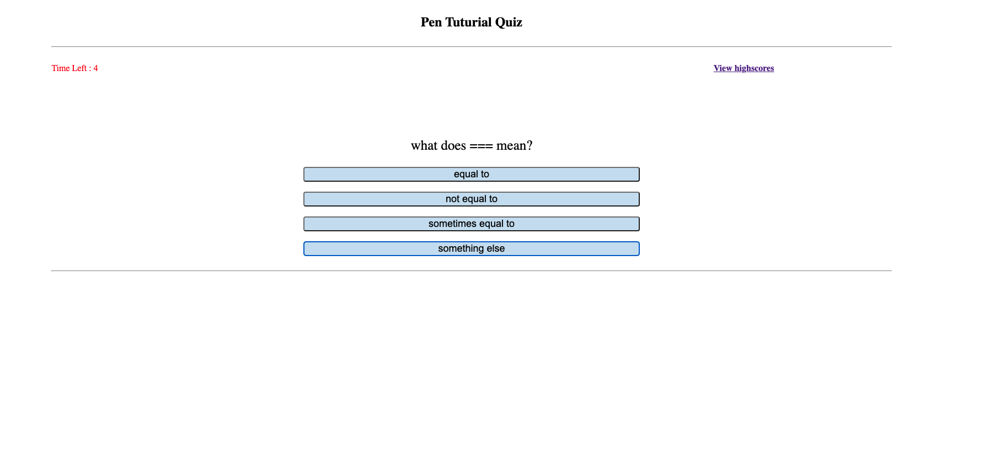
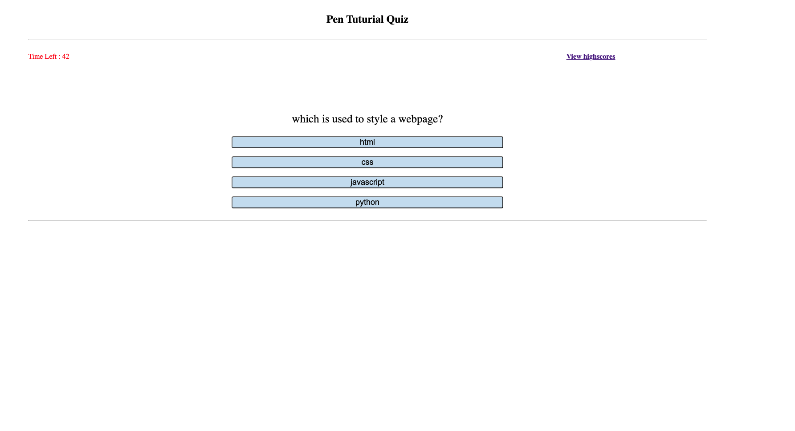
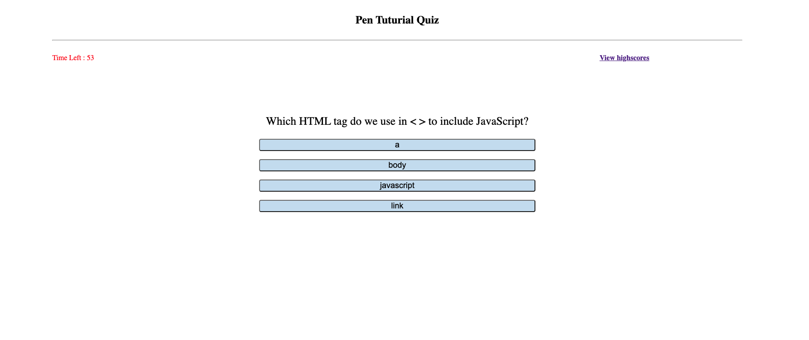
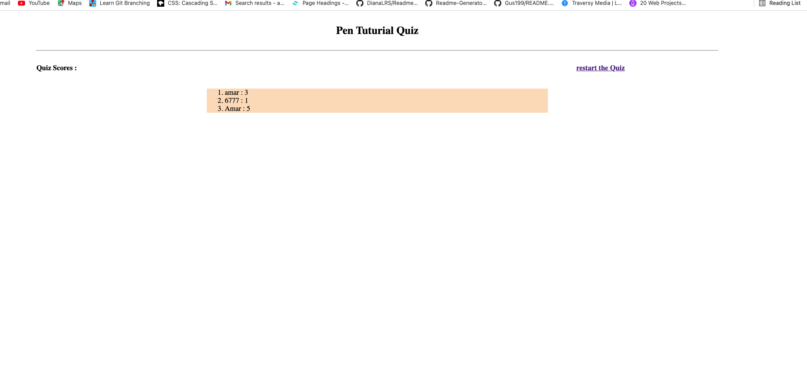

# -Code-Quiz
This is a timed quiz, multiple-choice questions and interactive coding challenges application using HTML, CSS, and Javascript. This application emphasizes the use of Javascript to provide quiz questions and collect user data to determine whether the answers to a question are correct, this then generates a score and appends a final page of results from the user data. I also added a feature that randomized the questions everytime the application starts and real time scoring that tells the user if the answer is correct or wrong, at the end you will enter your name and the score will be saved and displayed

## The following is a screenshot preview of the game

